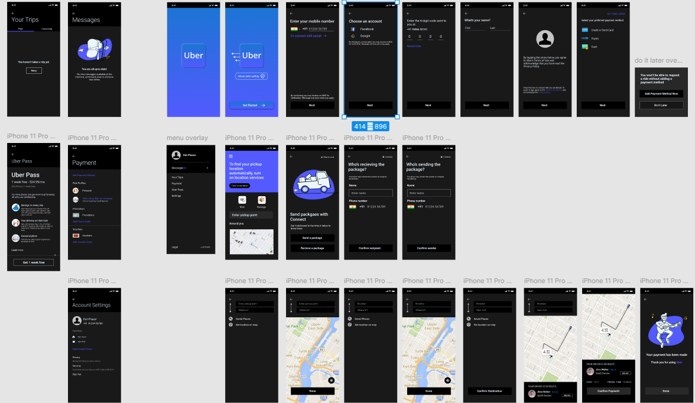

# uber_app_Clone

A Flutter project inspired by the Uber app, featuring a modern UI design and a clean, scalable code
structure.

## Features

- Built using **BLoC** for state management, ensuring a clear separation of concerns and
  testability.
- Implements the **MVP architecture** for modular and maintainable code.
- Includes **common widgets** for reusability across the app, speeding up development and ensuring
  consistency.
- Designed to support **smooth animations** (animations to be added in future updates).
- Fully responsive UI for both Android and iOS platforms.

## UI Design

The app's UI was designed in Figma, focusing on intuitive user experience and sleek visuals.  
Explore the Figma design and prototype
here: [UBER APP DESIGN & PROTOTYPE](https://www.figma.com/design/uRzHdYuxxLI6QaX0eAeX0q/UBER-APP-DESIGN-%26-PROTOTYPE-(Community))

## Project Overview

## Getting Started

This project is a starting point for a Flutter application.

### Resources

- [Lab: Write your first Flutter app](https://docs.flutter.dev/get-started/codelab)
- [Cookbook: Useful Flutter samples](https://docs.flutter.dev/cookbook)
- [Flutter Documentation](https://docs.flutter.dev/): Tutorials, samples, and a complete API
  reference.

### Development Tips

- Follow the BLoC state management pattern for scalability.
- Use the pre-built common widgets in the `widgets` directory to maintain consistency and save
  development time.
- The code structure is modular and follows the MVP approach, making it easier to add new features
  or refactor existing ones.

## Future Enhancements

- Adding **animations** for smoother transitions and enhanced user experience.
- More features inspired by the Uber app to be included.

---

Feel free to clone this repository, explore the code, and adapt it for your own projects.
Contributions and feedback are always welcome!
